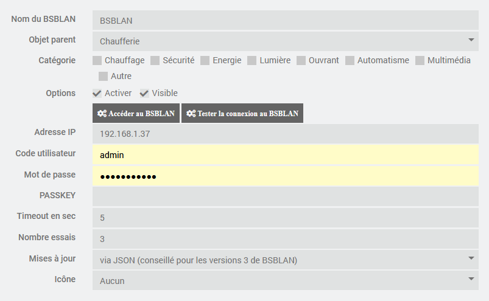
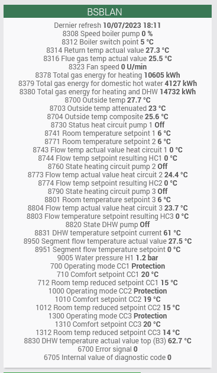

# Plugin BSBLAN

Plugin permettant de s'interfacer avec le controleur BSB-LPB-LAN. 

Le contoleur BSB-LPB-LAN est issu d'un projet dont le but est la communication avec les cartes SIEMENS pilotant de nombreuses chaudières, pompes à chaleur et autres dispositifs industriels. 

La documentation est très complète et se trouve à cette adresse https://github.com/1coderookie/BSB-LPB-LAN_EN . Le matériel peut être acquis auprès de Frederik Holst <bsb@code-it.de> .

Le BSB-LAN peut remplacer avantageusement les controleurs OZW fournis par Siemens. La solution est beaucoup moins onéreuse, permet l'accès à tous les paramètres des cartes Siemens (contrairement à l'OZW) et les temps d'accès au cartes sont beaucoup plus rapides. Par ailleurs, il est possible d'envoyer la température des zones chauffées sans avoir besoin de passer par une sonde d'ambiance.

La communication entre le plugin et le BSBLAN s'effectue via des WEB APIs.

# Installation et configuration du controleur BSBLAN

Le bon fonctionnement du plugin suppose que le module BSB-LAN soit opérationnel. 

Pour l'installation et la configuration, se repporter à l'excellente documentation disponible sur le site du projet ou en PDF.

Si on souhaite modifier des paramètres, il faudra l'autoriser dans la configuration du BSBLAN.

Le plugin a été testé avec une version 3.2. A priori, le plugin devrait fonctionner avec des versions antérieures car les appels aux APIs sont assez basiques et doivent exister depuis de nombreuses versions.

# Configuration du plugin

Une fois le plugin installé, il faut l'activer.

Vous pouvez activer le niveau de log Debug pour suivre l'activité du plugin et identifier les éventuels problèmes.

# Configuration des équipements

La configuration des équipements est accessible à partir du menu du plugin (menu Plugins, Objets Connectés puis BSBLAN). 

Cliquer sur Ajouter pour définir le controleur BSBLAN.

Indiquer la configuration de l'BSBLAN :

-   **Nom** : nom du BSBLAN
-   **Objet parent** : indique l’objet parent auquel appartient l’équipement
-   **Catégorie** : indique la catégorie Jeedom de l’équipement
-   **Activer** : permet de rendre l'équipement actif
-   **Visible** : le rend visible sur le dashboard
-   **Adresse IP** : IP de l’équipement
-   **Compte et mot de passe** : codes d'accès au WEB server
-   **Passkey** : prefixe à fournir au requêtes html (voir documentation BSBLAN)
-   **Icone** : permet de sélectionner un type d'icône pour l'équipement dans le paneau de configuration

Il est possible d'associer une icone spécifique au BSBLAN. On peut également personaliser une icone de type perso en ajoutant l'image correspondante (par exemple perso1.png pour l'icone perso1) dans le répertoire plugin_info du plugin.

Les boutons suivants permettent les fonctions suivantes:

-   **Accéder au BSBLAN** : permet d'ouvrir une session WEB sur le BSBLAN
-   **Tester la connexion au BSBLAN** :  permet de tester si les paramètres de connexion sont corrects (penser à sauvegarder la configuration avant de cliquer sur le bouton).

# Commandes associées aux équipements

Par défaut, une commande de type info est créée :

- Dernier Refresh : indique quand la dernière information du BSBLAN a été mise à jour

Les boutons suivants sont disponibles :

- Importer un paramètre : permet de créer une commande info pour un paramètre spécifique
- Ajouter une action : permet de modifier la valeur du paramètre (lorsque c'est permis dans le WEB serveur)
- Ajouter une commande refresh : permet de forcer la récupération de la valeur du paramètre

# Analyse des champs de la commande

Pour chaque commande relative à un paramètre, on trouve en plus des champs habituels de jeedom :

- le LogicalID: 
  - pour les commandes de type info, égal au code du paramètre
  - pour les commandes action, égal à 'A_' suivi du code du paramètre
  - pour les commandes refresh, égal à 'R_' suivi du code du paramètre
- la coche update qui permet de demander ou non la mise à jour du paramètre
- le champ scan qui indique la fréquence de mise à jour du paramètre

# Widget

Voici un exemple de widget. On peut modifier le nom des commandes pour que ce soit plus parlant. 
